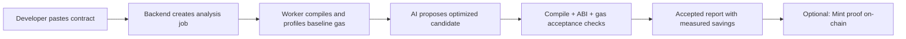

# Project: Problem, Solution & Impact

One place for the **what** and **why** of GweiZero.

---

## 1. Problem

- Solidity teams often know their contracts are expensive, but do not get fast, function-level optimization guidance with proof.
- Gas optimization is still manual, slow, and inconsistent, especially for smaller teams without dedicated audit budgets.
- Existing tools frequently provide static hints only, without validating whether suggested changes truly reduce gas in execution.
- On BNB Chain/opBNB, this directly impacts user cost and product retention for high-traffic contracts.

---

## 2. Solution

- GweiZero is an AI-powered gas optimization pipeline:
  - parse and profile Solidity contracts
  - generate optimization candidates
  - validate candidates through compile + gas benchmarking
  - accept only candidates that pass final validation rules
- It combines deterministic execution (worker-based Hardhat profiling) with robust AI generation (schema validation, repair retries, verifier pass, fallback models).
- It can produce an on-chain optimization proof payload and mint to `GasOptimizationRegistry` once an optimization is accepted.

**Optional — user journey (Mermaid):**

---

## 3. Business & Ecosystem Impact

- **Target users:** BNB Chain smart contract developers, hackathon teams, protocol teams, and auditors.
- **Ecosystem value:** lowers gas costs, improves contract quality, and creates transparent optimization evidence.
- **Developer value:** faster optimization iteration with fewer manual review cycles.
- **Sustainability path:** open core + optional premium features (batch analysis, private projects, CI integration, API usage tiers).

---

## 4. Limitations & Future Work

- Current static analysis and gas estimation input generation is intentionally conservative for MVP speed.
- Worker jobs are Postgres-backed but not yet sharded/queued across multiple worker replicas.
- `GasOptimizationRegistry` contract integration is implemented at backend API level; full contracts package + deployment automation is next.
- Near-term roadmap:
  - richer optimization patterns and safety checks
  - frontend cinematic HUD implementation in `src/frontend`
  - Redis-backed queueing and horizontal worker scaling
  - multi-chain expansion beyond BNB/opBNB
