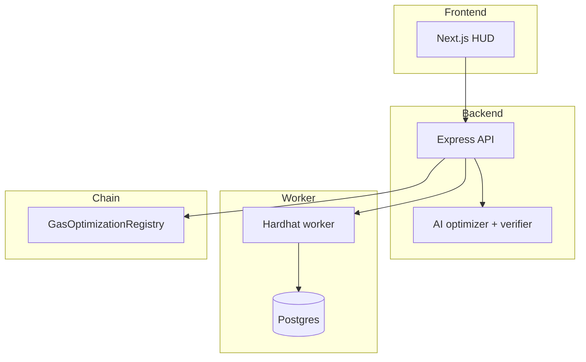
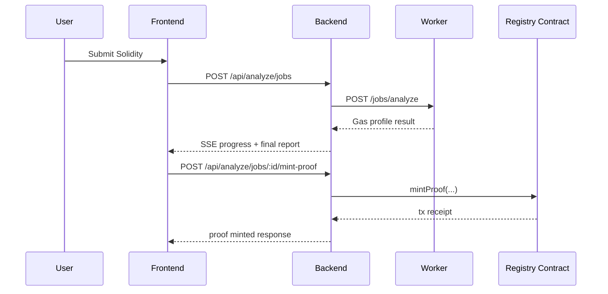
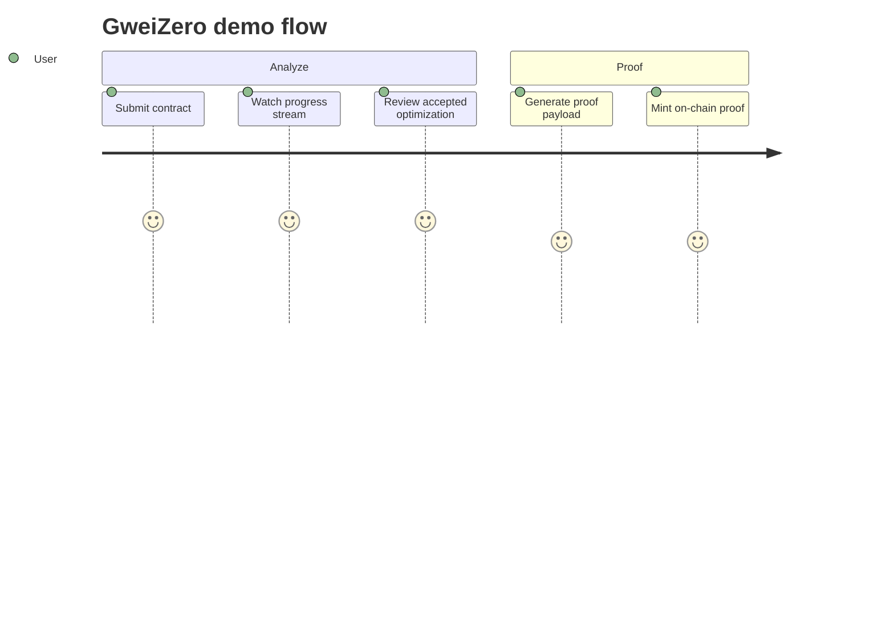

# Technical: Architecture, Setup & Demo

One place for **how** GweiZero works and how to run it.

---

## 1. Architecture

- **System overview**
  - `src/backend` orchestrates analysis jobs, AI optimization loops, final acceptance validation, and proof minting endpoints.
  - `src/worker` runs heavy Hardhat compile/deploy/gas tasks asynchronously and persists worker jobs in Postgres.
  - `src/frontend` (planned) consumes async APIs and SSE streams for cinematic analysis UX.
- **Components**
  - Backend API (Express + TypeScript)
  - Worker API (Express + TypeScript + Hardhat runtime)
  - Postgres (worker job persistence)
  - Optional chain RPC + registry contract for on-chain proof minting
- **Data flow**
  - User submits code -> backend creates analysis job
  - backend requests worker baseline gas profile
  - backend runs AI candidate generation/verifier/fallback loop
  - backend validates candidate by recompiling and re-profiling
  - accepted result returned; optional proof payload/mint
- **On-chain vs off-chain**
  - Off-chain: parsing, profiling, AI generation, validation
  - On-chain: optional `GasOptimizationRegistry.mintProof(...)`
- **Security**
  - Heavy untrusted compilation isolated in worker process
  - AI output is never auto-accepted without compile/ABI/gas checks
  - Proof mint endpoint requires explicit signer env vars

**Component diagram (Mermaid):**



**Data flow (Mermaid):**



---

## 2. Setup & Run

- **Prerequisites**
  - Node.js `20+`
  - npm
  - Docker (recommended for local Postgres)
- **Environment**
  - Worker: `DATABASE_URL` is required
  - Backend: `COMPILATION_WORKER_URL`, AI keys (`GEMINI_API_KEY` or `GOOGLE_API_KEY`), optional `OPENAI_API_KEY`
  - Optional minting: `CHAIN_RPC_URL`, `BACKEND_SIGNER_PRIVATE_KEY`, `GAS_OPTIMIZATION_REGISTRY_ADDRESS`
- **Install & build**

```bash
cd src/worker
npm install
npm run build

cd ../backend
npm install
npm run build
```

- **Run**
  1. Start Postgres:

```bash
docker run --name gweizero-postgres \
  -e POSTGRES_PASSWORD=postgres \
  -e POSTGRES_USER=postgres \
  -e POSTGRES_DB=gweizero_worker \
  -p 5432:5432 \
  -d postgres:16
```

  2. Start worker:

```bash
cd src/worker
cp .env.example .env
npm run dev
```

  3. Start backend:

```bash
cd src/backend
cp .env.example .env
npm run dev
```

- **Verify**
  - Worker health: `GET http://127.0.0.1:3010/jobs/health`
  - Backend async flow: create job via `POST /api/analyze/jobs`, then stream `/api/analyze/jobs/:id/events`

---

## 3. Demo Guide

- **Access**
  - Local backend: `http://127.0.0.1:3001`
  - Worker: `http://127.0.0.1:3010`
- **User flow**
  1. Submit Solidity code to backend async endpoint.
  2. Observe progress events (`queued`, `static_analysis`, `dynamic_analysis`, `ai_optimization`).
  3. Wait for `completed` status and inspect accepted optimization + validation metadata.
  4. Optionally request proof payload and mint on-chain.
- **Key actions**
  - Create analysis job
  - Track SSE progress
  - Inspect `optimizationValidation.accepted`
  - Trigger `/proof-payload` and `/mint-proof`
- **Expected outcomes**
  - Returned report includes baseline gas profile, optimized candidate, and acceptance checks.
  - If candidate fails acceptance policy, backend returns safe fallback with warnings.
- **Troubleshooting**
  - Worker fails immediately: check `DATABASE_URL` and Postgres availability.
  - Backend stalls on dynamic phase: confirm `COMPILATION_WORKER_URL` and worker health endpoint.
  - AI fallback mode: verify provider keys and outbound network access.
  - Mint failure: verify RPC URL, signer private key, and registry address.

**Optional — demo user journey (Mermaid):**


